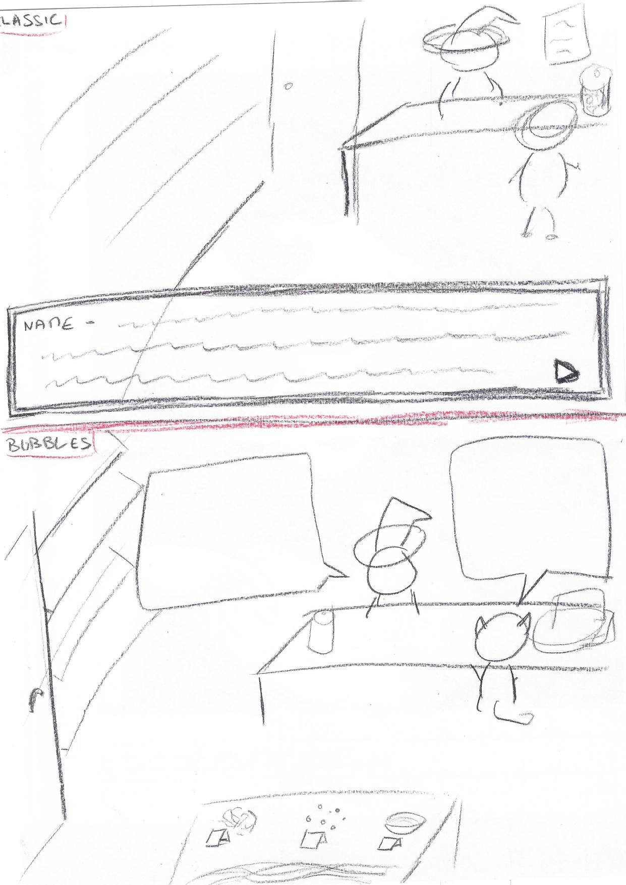
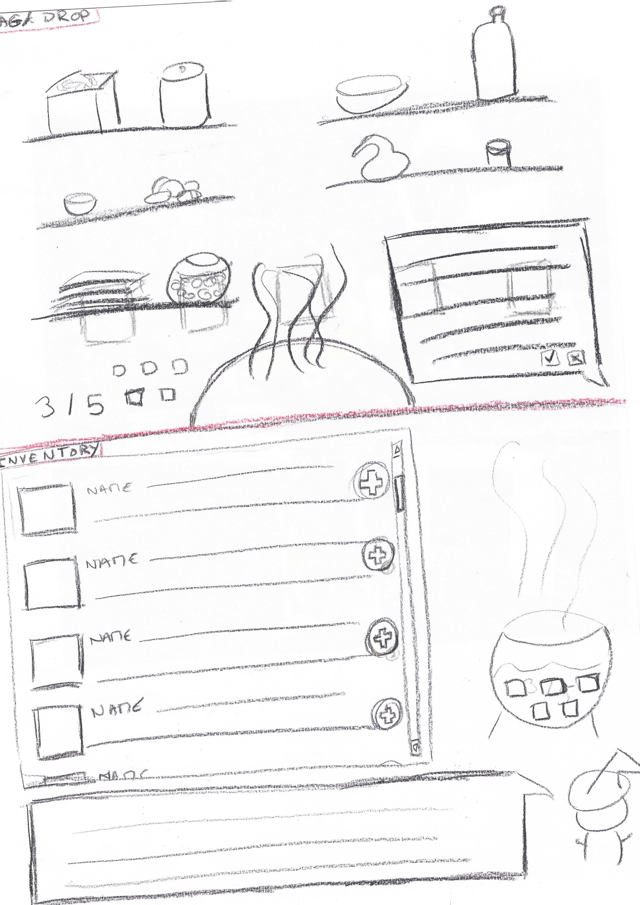

# nb-jam
Non binary game jam 2022

## Game description
### Genre
Kinetic novel with a crafting minigame

### Pitch
A witch (NB?) gets really upset when some parent comes to their shop to ask for a potion to make their trans son "back into a girl". They decide to f*** up with transphobes by making potions that change your gender, with the most confusing gender identities possible, and poison transphobes with them so they can see how it feels when your gender is not what you/society expect it to be. They calm down after a time, realise it's maybe not very constructive, but the "gender potion" concept is still interesting, so they launch a brand of "gender for a day" tailored potions to help questioning people figure things out. It would be a cooking game with a story more than a visual novel, because the way I see it the story would be rather linear but the player would be able to experiment with the "build-a-gender" potion minigame

### Storyline
1/ [Kinetic novel scene] The witch is in their shop. A costumer comes in. After some small talk, the costumer asks for a potion to make their trans son "a girl again". The witch gets furious and kicks the costumer out.

2/ [Kinetic novel scene] The witch is in their workshop/potion lab. Monologue rant on transphobia, ending up with the idea to create potions to poison transphobes into temporarily having a very confusing (for them) gender. Some world building info on potion crafting. Decides to create at least 3 different "gender potions", as confusing as possible

3/ [Potion minigame] You add 5(?) ingredients to create a potion. The witch gives a recap of what the potion will do when bottling it, and maybe some running commentary while picking the ingredients. Played 3 times in succession, with an option to keep creating more potions once you already have 3 different ones. What potions you create have no impact on the game.

4/ [Kinetic novel scene] The witch is in their shop. A box filled with potion bottles is on the counter. A friend comes in. The witch requested they come, they want their help to go to a bar that's know to be very unfriendly to trans people and put the potions in the drinks. The friend protests that it's violent and also a crime. They argue until the witch agrees that it's maybe not super helpful to the cause. The friend ask if the gender potion have to be malicious, because they'd be really interested in a potion that make them a woman for a day, just to understand how what they feel is different. The witch says it's possible and ask a few questions to better understand the request.

5/ [Potion minigame] This time the potion has a goal, so the witch will say that the potion isn't quite right and you'll have to start again if you get it wrong. It wouldn't be too difficult, with maybe hints from the witch in the running commentary

6/ [Kinetic novel scene] The witch is in their shop. The friend comes in and is very enthusiastic, explaining how using the potion helped them feel clearer about their gender and more confident about explaining it to other people. The friend suggests that they might want to develop this try-a-gender potion concept. The witch agrees.
[Possible add: the friend brought someone with them that wants a potion too, some dialogue with this new person then potion minigame identical to 5]

7/ [Kinetic novel scene] The witch is in their shop. A costumer comes in, shyly saying they heard about gender potions and could they have one? So Q&A about what the costumer wants for the potion.

8/ [Potion minigame] [Identical to 5]

9/ [Kinetic novel scene] The witch in their workshop. Monologue about the unexpected success of the try-a-gender potions. Talk about how they have received a request for a gender potion by someone who wants a potion not because they want to explore their gender, but because they feel a lot a dysphoria as a non-binary person and they feel like life would be easier if they were of their assigned-at-birth gender. Thoughts about whether it would be a good thing to "treat" dysphoria that way, and how it could become a transphobic weapon very fast, like what her initial costumer requested. -> An epilogue discussing how the witch can continue helping others with their potions, but how they are also not sure where they should put the limit. It should be clear that they are not going to stop making the potions.

### Characters
#### Main character: the witch
Name:
Pronouns:
Gender info:
Sketches:

Character blurb:

Other info:

#### Costumer 1: the transphobic parent
Name:
Pronouns: He/him
Gender info: Cis-man
Sketches:

Character blurb: Father to a trans son, likes to think of himself as accepting of his trans son, but dreams of him actually being a girl and has convinced himself that it would also be better for his "daughter" because being trans is hard

Other info:

#### Costumer 2: the friend
Name:
Pronouns: She/her
Gender info: Demigirl, still somewhat questioning their gender
Sketches:

Character blurb: Close friend to the witch, not afraid to tell the witch what she thinks. Autistic, with a passion for understanding people's thought processes.

Other info: Does NOT like to go against rules.

#### Costumer 3: the shy one
Name:
Pronouns:
Gender info: Not cis
Sketches:

Character blurb:

Other info: Likes bow-ties.

### Screens
#### Menu screen

#### Options screen

#### Novel screen
Sketches:

Option "Classic": The text is displayed in the box at the bottom of the screen, in a classic visual novel configuration.
Option "Bubbles": The text is displayed in speech bubbles next to the corresponding character, like in comics.

If we want the witch to be animated, we need to layer background + witch + counter + costumer.

#### Potion screen
Sketches:

Option "Drag&drop": If you click on an item you get the description in the bottom-left bubble. You can add an item either by dragging it into the cauldron, or clicking the checkmark in the description bubble. On the left you have a number indicator for how many ingredients you still need and miniatures of the ingredients you've already added. It requires two drawings for each ingredient : on the shelf + miniature icon
Option "Inventory": You can see all the possible ingredients and their description/effect. You add them with a button. On the right is the cauldron, with miniatures to show what ingredients you've added and how many you still need. The bottom has running commentary from the witch, things like "uh oh, their pronouns are not going to be what they expect according to their genitals, very confusing niark niark niark" (this is a very random example ^^)

#### Ending screen

## TODOs
### Programming
#### Kinetic novel
- [] List functionalities

#### Crafting
- [] List functionalities

#### Options
- [] List functionalities

### Visual assets
Assets should be in WebP format. This can help convert them to the right format: https://blog.argentgames.co/post/2019-04-08-renpy-image-optimization-imagemagick/
#### Characters
- [] Sketch characters
  - [] The witch
  - [] The transphobic parent
  - [] The friend
  - [] The shy one
- [] List assets and requirements

#### Backgrounds
- [] Sketch backgrounds
  - [] The shop
  - [] The potion lab
- [] List assets and requirements

#### UI elements
- [] List assets and requirements
  - [] Neutral background for menu and potion screen UI (1280*720)
  - [] Dialogue box

### Sound assets
- [] List assets and requirements

### Design and writing
- [] Design crafting ingredients and results
- [] Flesh out characters
  - [] The witch
  - [] The transphobic parent
  - [] The friend
  - [] The shy one
- [] Write chapters
  - [] Intro (1)
  - [] First monologue (2)
  - [] Friendly argument (4)
  - [] Enthusiastic friend (6)
  - [] Shy costumer (7)
  - [] Epilogue (9)
